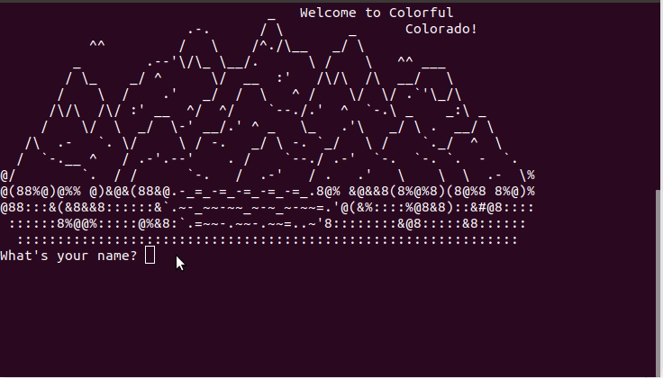
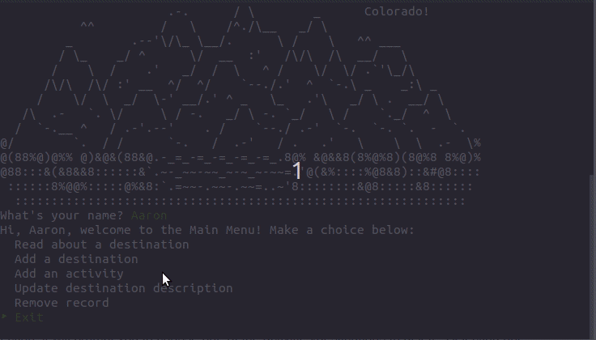
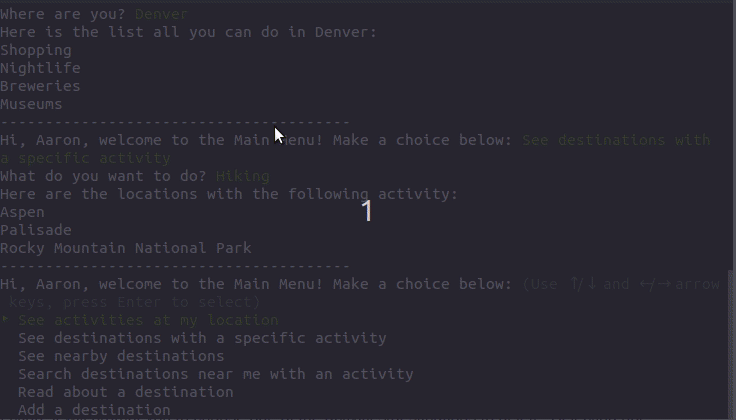
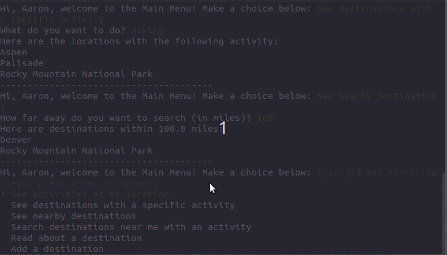
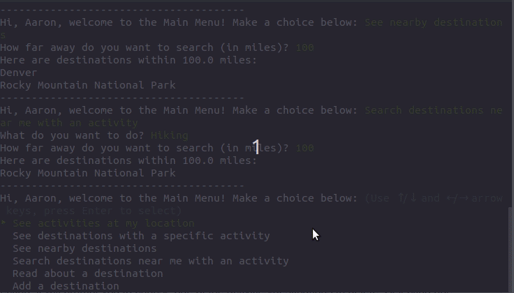
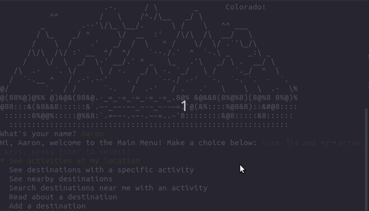
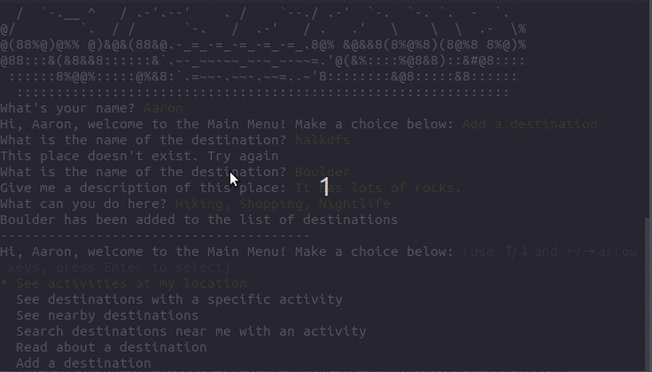
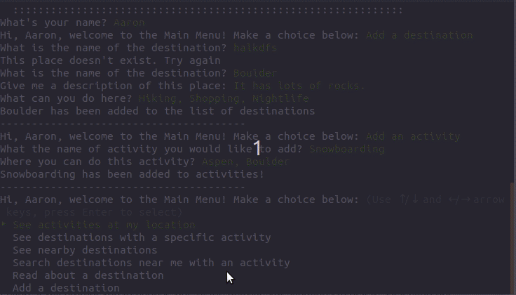
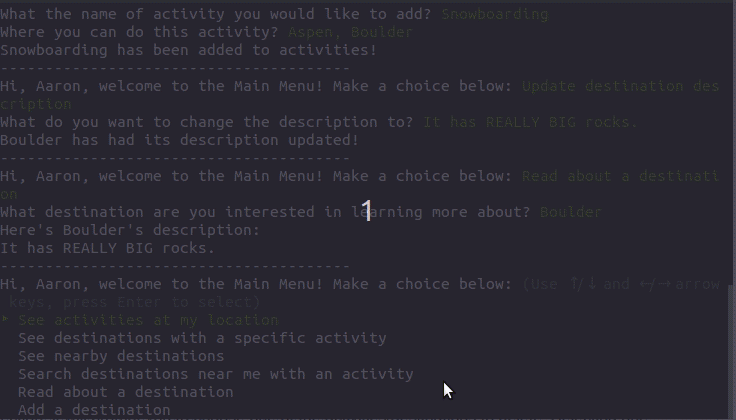

# Colorado Road Trip

### Overview  
The Colorado Road Trip program is a command line program that stores and retrieves information on various destinations within Colorado. By design, this program only works within Colorado, and you cannot enter fictional locations.

### Features  
This program has features that may be useful when taking a road trip in Colorado. For a list of features and their descriptions, see the interface section.

### 1. Usage  
To run:  
You must have ruby installed to run this program.  
Download the code from here. Above, click "Clone or Download", select "Download ZIP"
Extract the ZIP in a directory.  
In the command line, navigate to the directory where you put the extract the ZIP - this directory contains the code.  
Type `ruby runner.rb` in the command line.  

This code makes use of the following Ruby gems:  
TTY-prompt  
Geocoder  
Haversine  
Sqlite3  
Sinatra  
Activerecord  

### 2. Interface
Upon loading, it will ask you your name and location. Once the system has this information, it will ask you what you want to do and provide you with a list of options. 

  

See activities at my location  
See destinations with a specific activity  
See nearby destinations  
Search destinations near me with an activity  
Read about a destination  
Add a destination  
Add an activity  
Update destination description  
Remove record between activity and destination  

You can navigate the options by using the arrow keys, and select an option by using the Enter key.

**2.1 See activities at my location**  
Purpose: When you arrive in a town, you may wonder what there is to do. This option will provide you a list of activities at your location.

**2.2 See destinations with a specific activity**  
If you are seeking out a specific activity, this option will show you all of the places with tht activity.

**2.3 See nearby destinations**  
If you’re looking to continue on your Colorado road trip, you may be looking for nearby destinations. This option will show you all of the destinations within a given radius (specified in miles, you communist!).

**2.4 Search destinations near me with an activity**  
If you’re looking for a nearby destination with a specific activity, this option will provide that. You will need to specify the search radius and the activity.

**2.5 Read about a destination**  
This option allows you to choose a destination, after which you can read the description of that destination.

**2.6 Add a destination**  
This option allows you to add a destination to the database. You need to specify the destination name and a list of activities at the destination. It is assumed (and required) that the destination be in Colorado. You can optionally specify a description of the destination if you like.

Note that the destination must be a named place in Colorado. The program will prevent you from entering anything other than named places in Colorado.

**2.7 Add an activity**  
This option allows you to add a new activity to the database. You need to specify the activity name and all of the places that you can do the activity.

**2.8 Update destination description**  
This option allows you to update the description of a destination.

**2.9 Remove record**  
This option will first prompt you for clarification on whether you want to remove an activity or a description. After making a selection, it will prompt you to choose one of the activities/destinations to delete. Selecting one and pressing enter will delete the entry.

**2.10 Exit**
This exits the program

### 3. Settings
This program has no settings.

### 4. License
This code is considered public domain. You are free to copy it, but you may not monetize it. Attribution is always appreciated. :)

The following people contributed to this program:  
Aaron Burmeister  
Parada (Alice) Richardson  
Michael Newman  
